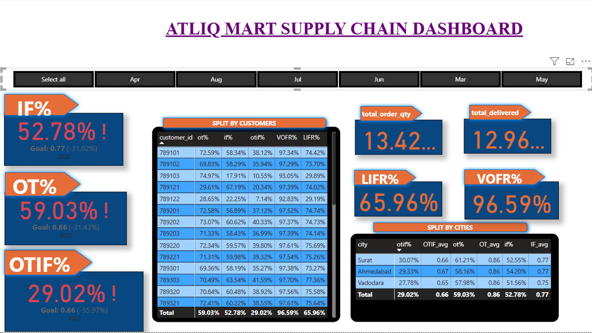
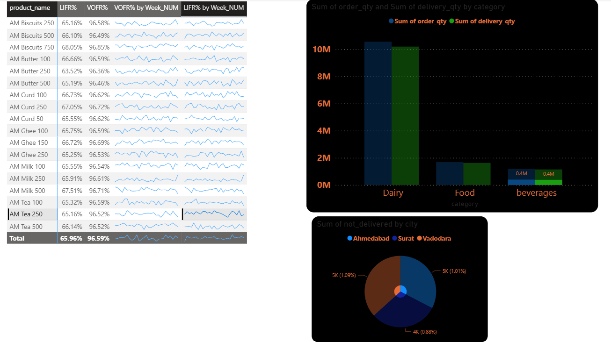
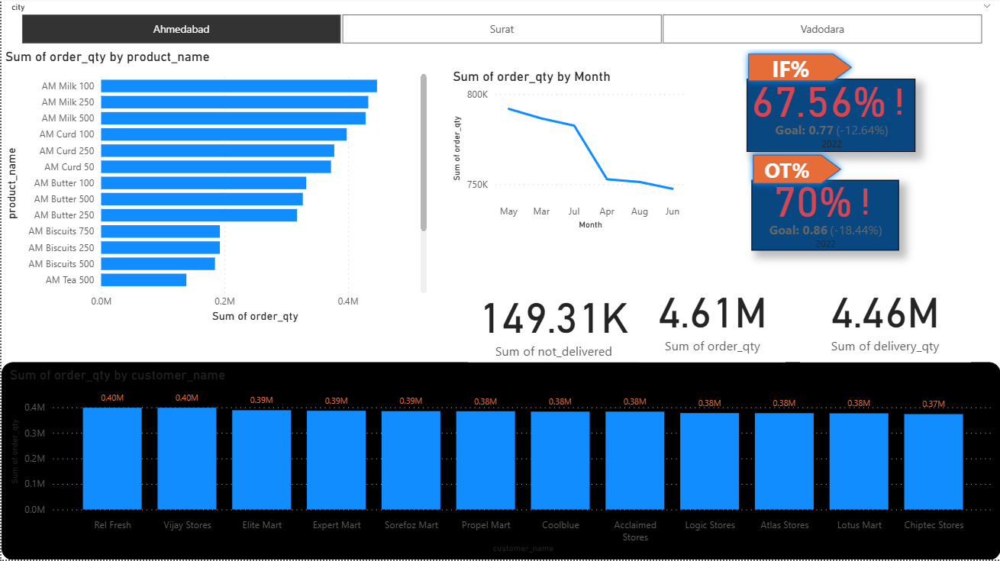

# Supply Chain Management for AtliQ Mart

## Overview
This repository contains a Power-BI analytics solution designed to provide insights into the supply chain management for AtliQ Mart.

AtliQ Mart is a growing FMCG manufacturer headquartered in Gujarat, India. It is currently operational in 3 cities Vadodara, Surat and Ahmedabad. They want to expand to other metro or tier 1 cities in the next 2 years.

AtliQ Mart is currently facing a problem where a few key customers did not extend the annual contract due to service issues. It is speculated that some of the essential products were either not delivered on time or not delivered in full over a continued period, which could have resulted in bad customer service.
Management wants to fix this issue before expanding to other cities and requested their supply chain analytics team to track the 'On Time' and 'In Full' delivery service level for all the customers on a daily basis so that they can respond swiftly to these issues.

The Supply Chain team decided to use a standard approach to measure the service level in which they will measure 'on-time delivery (OT)%', 'In-full delivery (IF)%' and 'On Time in full (OTIF)%' of the customer orders on a daily basis against the target service level set for each customer.

## Project Structure

project(Supply_Chain_Mgmt)/ 
├── README.md # Documentation  
├── dataset/ # raw and cleaned data sources  
├── visuals/ # exported screenshots of dashboards  
└── reports/ # Power BI project files (.pbip) 

## Technologies Used

* Power BI Desktop - Data Modeling and Visualization
* SQL or Python - Data preprocessing and ETL
* GitHub - Version Control and Collaboration

## Key Features

* Interactive Dashboards with drill-down filters
* Trend Analysis and Forecasting
* KPI tracking across multiple dimensions
* Exportable reports for stakeholders

## Setup Instructions

* Clone the repository
* Open the .pbip file in Power BI Desktop
* Update the data source connections in dataset settings
* Refresh the report to load data

## Dashboard Preview

  
  

## Contributing

Contributions are Welcome!

* Fork the Repository
* Create a Feature Branch
* Submit a Pull Request

